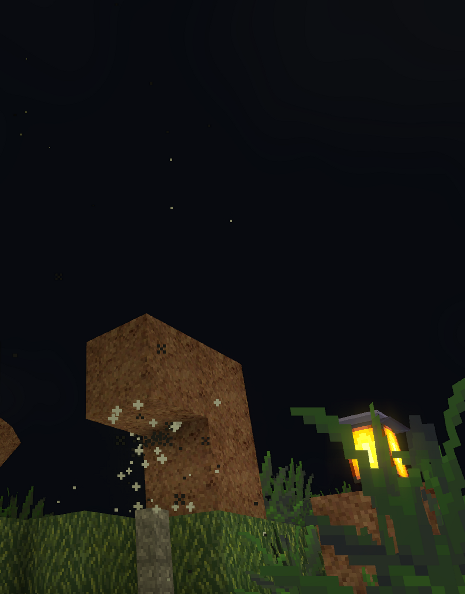

# Particle system



AnotherCraft posseses a **particle system.**

- The particle system **runs on the GPU**, it can handle a huge amount of particles.

- The particles can collide with the world (they can be stopped by/bounce of blocks)

  - This is limited to the voxel grid only, no precise collisions

- The particles can be **shaded** - they respond to the light environment they’re in

- Particles are tastefully spawned when a player is running, hits a block, when a block is spawned/destroyed

- The particles can be animated (change sprite during lifetime; realized by X tiling of the texture) and have multiple variants (variant is selected randomly during particle spawn; realized by Y tiling of the texture).

  - The tiling is a property of the `RenderContextTextures`. Let's take for example this particle texture:
    
    And now we define the particle in the yaml:

    ```YAML
    particle:
      texture:
        file: particle/test.png
        xTiles: 2 # 2 frames of particle animation
        yTiles: 2 # 2 versions of the particle
    
      shadowCasting: true
      collision: collide
    ```


## Implementation

