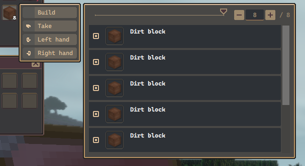

# Items

I think it's not necessary to explain what items are.

* Each item is represented by a `ItemInstance` class instance. There is no aggregation for stacks of items.
* Each item has a persistent handle that uniquely identifies it within a game.
* While items can be in void (not assigned to any inventory), they're usually worked with while inside an inventory.
* Items are transferred between inventories using inventory transactions (standard, slot swap or crafting) - more on that elsewhere.
* When items are placed in the world (thrown from the inventory, dropped from blocks, ...), it's not really the item you see, it's the `entity.item` entity that holds the items inside and renders them through `IA_WorldRender` 
* Items can be equipped onto entities. In that case, they're rendered through `IA_EquippedRender`
* Items also have icon that is used in the GUI - that one uses `IA_Icon`.

### Item uniqueness

In AnotherCraft, generally, most items are intended to be unique – even stuff like dirt might have parameters like dirt quality. This goes a bit against the standard item stack based approach – how do you want to stack and organize items when each of them is unique?

Well, AnotherCraft has a unique solution for that. You still work with stacks of items of the same type, but you're also able to granularly inspect and manipulate with the individual items within the stack. This is done through the context menu. There is more functionality intended for the future like sorting and filtering of the items in the stack.

## Multiplayer synchronization

* Client receives updates to items that are in an inventory that is in a subscribed chunk (or possibly the inventory has subscription through other means which are not implemented yet).
* Items are basically always received only as a part of an inventory.
  * Either as a part of the whole serialized inventory (inside `ACP::Inventory`),
  * or as a part of partial inventory synchronization (within `ACP::InventorySlot`).
  * Requesting items by persistent handle is not supported, unlike entities.
  * More information about these mechanics can be found in [inventories](items/inventories.md).
* Item changes/updates are handled by their respective components/callbacks that handle the changed properties. There is however currently no mechanic for updating say item properties dynamically.
  * For example `IA_SetProperty` broadcasts `ACP::ItemPropertySet` (and that's the only case here probably)

## Item properties

Items posses a similar property mechanism as is described for blocks, though a bit simplified.