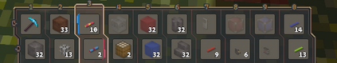

# Player inventory

Player inventory system is significantly different to the Minecraft, it is more similar to World of Warcraft.

* The player has a *meta inventory* of 5 slots. This inventory is not meant for items, it is meant for *bags*.
* The meta inventory can contain up to five bags that serve as actual inventories. The bags can differ in various properties, such as:
  * The capacity of the bag (how many inventory slots it has).
  * What types of items the bag can contain (you could have say a bag only for arrows - a quiver, or for herbs, or other stuff)
  * Whether items from the bag are accessible from the hotbars (this can be useful when you say don't want to accidentally consume a specific potion, use a specific weapon and so)
  * Whether the bag can be moved when not empty
* There's still the cursor single-slot inventory, same as in Minecraft.

## Hotbars

* The hotbars in the HUD are not inventories – they are `SlotInterface`s (resp. `QMLSlotInterface`s) that merely contain *links* to the player inventory.
  * These can link to a specific type of item - say all items of type `block.core.stone`. This causes that you can see and work with all items of the type inside all of your inventories.
  * The link can also link to a specific unique item - useful for say weapons and such.
  * The links are persistent - they don't disappear when you run out of the referenced items.
  * The same item/item type can be referenced in any number of slots.
* There is a single *main hotbar* with 10 slots.
  
  * The selected pair of slot represents what the player is currently holding in his hands.
  * Top row represents left hand items, bottom row right hand items.
  * The selected slot index can be changing using mouse wheel/shortcuts/gamepad.
  * Left mouse button (+ctrl for alternative action) triggers a left hand item action, right mouse button right hand item action.
  * A friendly reminder that the same item/item type can be referenced in any number of slots, so the player can have a for example pickaxe + dirt combination in slot 1 and the same pickaxe + stone combination in slot 2.
* There can also be other hotbars (currently there's one on the left of the screen). These are not connected to hands at all, however they can still be useful.
  * They can show you how many items of various types you have in your inventory.
  * They allow you to quickly interact with the items - you can take a stack of the item by clicking on the slot, you can trigger actions through the context menu.
  * Some item actions can also be triggered off hand. For example, you can build blocks by simply dragging them from the hotbar slot or inventory and releasing the button on the position you want to build the block on.