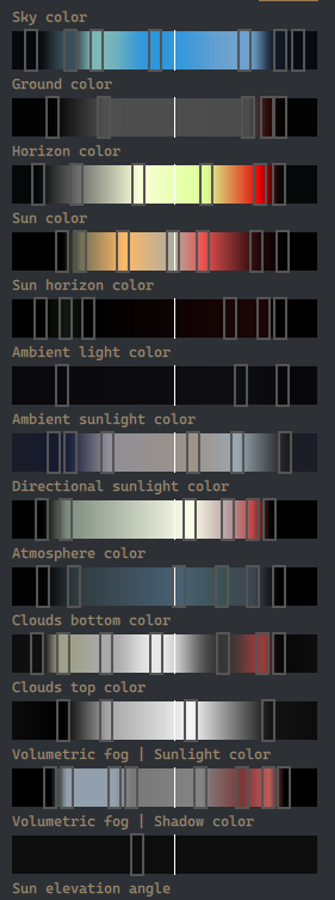
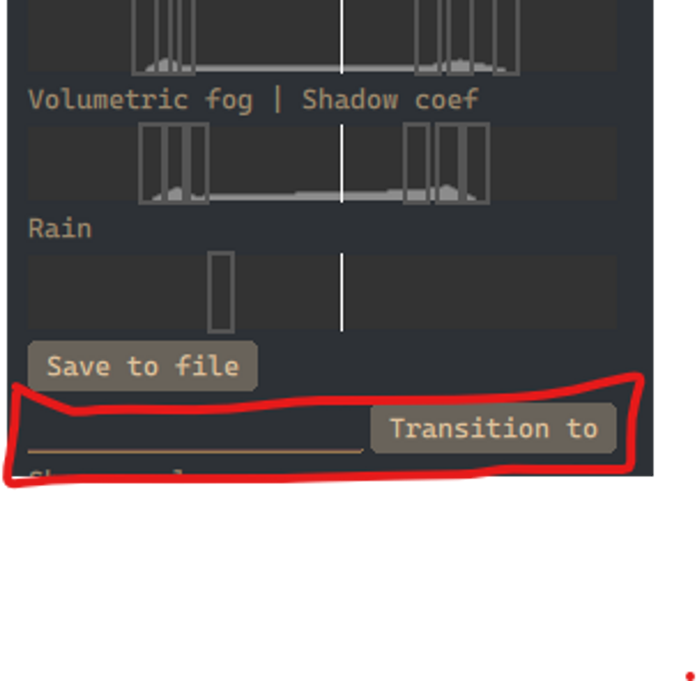
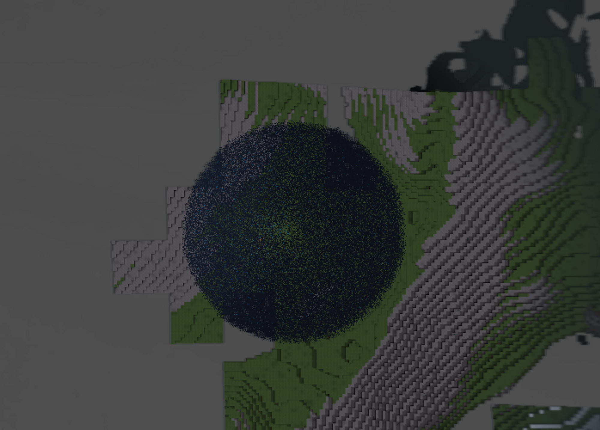

## Environment transitions, weather

- The skybox, sun, environment colors are defined as gradients that are sampled based on the day time (passed to the skybox and other relevant shaders).

​		Environment daytime gradients for the “cozy” environment

- **You can observe the day/night cycle** either by manually sliding the “Daytime” slider, or by enabling “Dynamic daytime” on the Control panel.

  - In the future, the day cycle will of course be synced from the server.

- These gradients can be adjusted in the control panel, stored and reloaded.

- Not only that, the engine can seamlessly transition between the environment configurations.

  - In the future, this feature will allow assigning different environments for example to different biomes (sand can have different sky color than forest), and also the environments can be dynamically switched to change weather.

  - For now, you can **check out transitioning between cozy day and rain.** Go to the control panel, locate the “transition to” field in the env settings, type in “rainy” and press “Transition to”. It should start raining after a few seconds. To transition back, type in “cozy” and again press the button.

    

  - The raindrops are actually realized by the GPU-accelerated particle system. Each raindrop is individually simulated, shaded and collides with the world.

    

    Rain from the top-down view