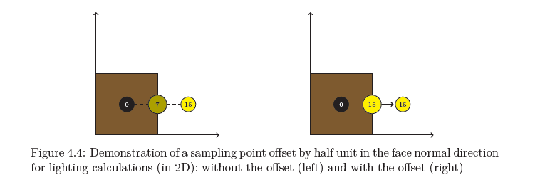
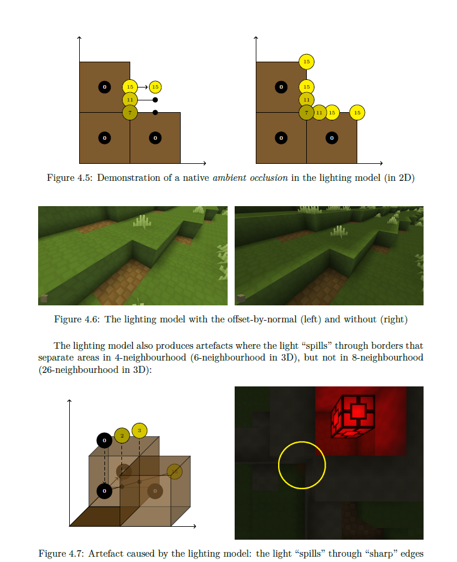

# Lighting

AnotherCraft employs a voxel-based lighting system not unlike the one in Minecraft.

* Each block is assigned a light value with 4 components: red, green, blue and daylight. The values correspond to the light in the center of the block. Each component is 4 bits, so there's 2 bytes of lighting data for each block. `15` is the maximum light value.
* The light values are calculated by first seeding the light in light source blocks and then propagating through the voxel grid. This is executed in parallel on the GPU.
  * The lighting propagation is implemented in `Chunk_ClientComponent::updateLightMap` and multiple shaders inside the `res/shader/lighting` directory.
  * Each propagation step, a light value of a block is calculated as component-wise maximum of the block light value itself and light values of its 6 neighbours decreased by [one plus current block opacity]. So light value decreases by 1 with each block in air.
  * The propagation is stopped when there are no changes – at most 5 (compute shader dispatches) * 4 (intra-dispatch propagation using shared variables inside a 8×8×8 workgroup) passes.
* The lighting is then stored inside a 3D texture on the GPU in sub chunks (16^3 blocks). The data are optimized out if the whole sub chunk is fully dark (0 on all components) or fully daylight (0 on RGB, 15 on daylight).

#### Daylight propagation

Daylight is propagated in the same way as other components with one catch – there is an initial sweep before the main propagation that propagates the daylight vertically without the implicit value decrease of 1 unit per block, starting with full daylight on the top of the chunk.

As a result, the light propagates freely downwards until it hits something, and then it propagates according to the standard rules.

#### Seeding light values

Apart for the beforementioned full daylight seed on the top of the chunk, there are two other way show to seed light sources:

* The light emission value can be defined in block static properties and is seeded based on the block ID.
* "Dynamic" light sources can be added using the `BA_LightMapUpdate` callback (requires subscription to `WorldEventPredef::lightMapUpdate`).

## Shading

* The shading is sampled and applied in the rendering fragment shader `primitive_render.fs.glsl`, the shading code itself is in `shading.glsl`. This means that 
* The core idea of shading is sampling the 3D texture with light data and interpolating between the neighbouring values.
  * Each component is interpolated independently.
  * The main trick is that the sampling position is moved by half a block alongside each face normal. This problematics is described in my AnotherCraft master thesis (in czech though). The ambient occlusion effect is an emergent behaviour of this implementation.
    
  * The color of the daylight component is determined by the world environment setting and changes based on the daytime.
  * The daylight component also considers shadow map data.
  * The RGB components are also affected by the `artificialLightPower` environment property – this is to make the daylight seemingly brighter during the day, making artificial lights (that use the RGB components) less noticeable.

## Properties of the lighting system

* The system doesn't really care about how many lights there are – the complexity is constant, meaning you can have as many lights as you want without any performance drop.
* Light sources are always considered to be in the middle of the block and can only be moved in whole blocks on the voxel grid.
* The lighting propagation takes some computing resources, so dynamically changing lights should be mostly avoided. Neither is it a good idea to move lights around (say connect them to entities).
* Because shading is done by sampling from a voxel grid in a real time, everything can be properly shaded without issues or performance drop – moving entities, even particles.