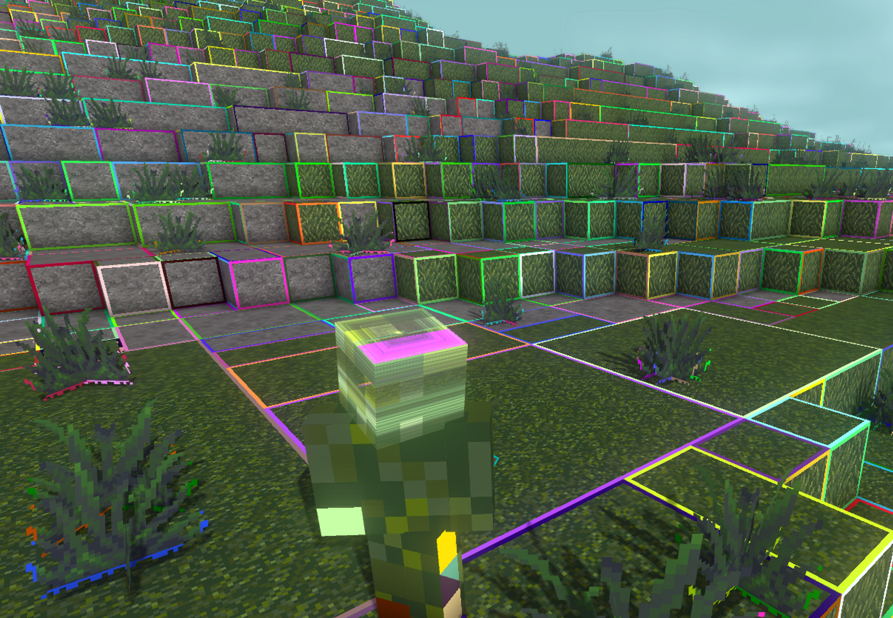

# Mesh generation

AnotherCraft has a system in place that generates optimized voxel mesh data that runs partially on the GPU. Chunk mesh generation is implemented in the `Chunk_ClientComponent` class. The system is not limited to the voxel grid – any shapes can be rendered, you can even import `fbx` or `obj` files and render them; however, specifically the voxel grid aligned mesh generation is designed in a way to generate heavily optimized meshes, that in turn allow rendering of vast view distances.

## Block render callbacks

There are three callbacks for blocks that do rendering.

* `BA_StaticRender` is used for setting up rendering of "static" parts of the world – those that are expected to be changed only sporadically (for example when a block is built/mined). Static mesh generation undergoes the heaviest optimization. Vast majority of blocks falls under this category.
  * Update of static render data can be triggered using `WorldBlockContext::notifyChange` with the `staticRender` flag or through `World_ClientComponent::flagXXX` with `FlagType::StaticRender`.
* `BA_SemiStaticRender` is used for rendering objects that are static most of the time, but occasionally change. A door is a good example - door mostly stays either closed or open and changes only when the player interacts with it.
  * Update of static render data can be triggered using `WorldBlockContext::notifyChange` with the `semiStaticRender` flag or through `World_ClientComponent::flagXXX` with `FlagType::SemiStaticRender`.
* `BA_DynamicRender` is used for rendering objects that changes constantly. This callback is called every frame.
  * There are currently no blocks that utilize this callback.
* `BA_MiningProgressRender` is used for rendering overlays visualising mining progress

 A single block or block component can use different callback for different parts of the block  you can have some parts of the block that stay static and some that move.

### Vertex and model animations

It is not always necessary to use dynamic render for block animation – there are ways to make certain animations work even when using static rendering for basically free in terms of computing resources.

#### Vertex animation through `RenderContextConfig`

`RenderContextConfig` provides the `animation` field that can apply per-vertex shader-based transformation. Value corresponds to a shader file located in `res/shader/render/animation`.

Some usage examples:

* `windOnlyTop` animation is used for making the grass, flowers etc wave in the "wind" (only top of the block waves in the wind - determined by the texture coordinates)
* `windWholeBlock` animation is used for animating the leaves

#### Model animation

It is also possible to do a per-model animation using `MultiRenderDataBuiulder::renderModel` and setting the animation inside `RenderRecordOverrides`. This animation works by applying a transform matrix to the model. Animations are registered in `Game_ClientComponent::renderDataAnimationManager`.

Usage examples:

* Dropped item (`entity.item` with `ETC_Item`) use `itemBounce` and `itemBounceRotate` animations without having to update entity render each frame

## Mesh generation process

Static and semi static rendering is split into render sub chunks (16x16x32 blocks).

1. A chunk gets flagged for static render/semi static render (dynamic render is called automatically).
2. For static render, the `chunk_render_optimizations.cs.glsl` shader is dispatched that generates optimization data for the mesh building. Semi static and dynamic renders skip this step and optimizations mentioned below are not performed.
   The shader:

   1. Determines which blocks are visible and which are completely surrounded by opaque blocks (opaqueness is determined by the `BlockRenderOptimizationFlag::fullyOpaqueBlock `flag in `BlockType::staticProperties`.  Blocks that are fully surrounded by opaque blocks are not rendered.
   2. Determines which sides of blocks are visible. Block sides that neighbour a fully opaque blocks are not rendered.
   3. Greedily aggregates visible block sides of blocks of the same type (block ID - stored in a 3D texture on the GPU as well). Those blocks sides are marked to be rendered only by one of the blocks that participate in the aggregation as one larger quad. For other blocks, the sides are reported as hidden. This is also done for the `(X|Y|Z)center`  special block "sides" that run inside the blocks and are not affected by sides being visible or not (used for example in `BTC_HashShape` or `BTC_CrossShape(3D)?`).
   4. Blocks that have all sides aggregated out and don't have `nonUniformRendering` render optimization flag are also optimized out.
   5. The shader then produces a list of `RenderRecord` and (asynchronously) passes it to the game thread.
      ```C++
      struct RenderRecord {
          StaticArray<RawBlockFaceAggregation, 9> faceAggregation;
          uint8_t visibleFaces;
          uint16_t chunkBlockIndex;
      };
      ```

      This is the list of blocks inside the sub chunk that need to have the render callback executed (vast majority of blocks is optimized out) alongside with information about which block sides are visible and how many faces (2D vector) are aggregated for each block side.

3. An appropriate callback (`BA_StaticRender/BA_SemiStaticRender/BA_DynamicRender`) is called over relevant blocks (for static render – blocks that have been reported by the optimization shader, for semistatic/dynamic render – blocks that are subscribed to `WorldEvent::semiStaticRender/dynamicRender`).

   - The callbacks are responsible for generating the mesh data using `MultiRenderDataBuilder`. The meshes are not required to adhere to the voxel grid. It is heavily recommended for the functions to respect the reported aggregations and visible faces whenever possible.

4. The client waits until the lighting data is available to not render the blocks in pitch black.

5. The resulting meshes are uploaded to the GPU, replacing previous meshes for the given render unit.

