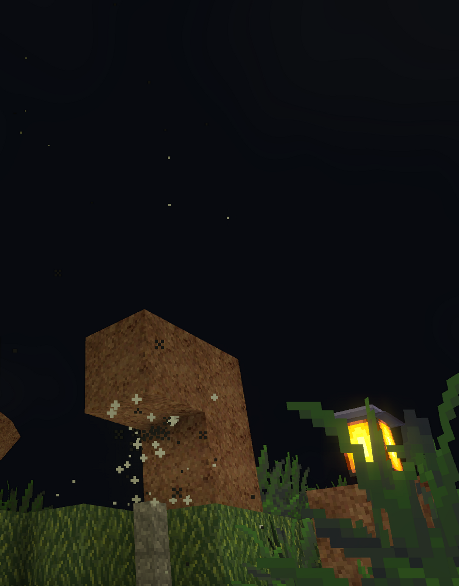

# Particle system



AnotherCraft posseses a **particle system.**

- The particle system **runs on the GPU**, it can handle a huge amount of particles.

- The particles can collide with the world (they can be stopped by/bounce of blocks).

  - This is limited to the voxel grid only, no precise collisions.

- The particles can be **shaded** - they can respond to the light environment they’re in. They can even cast shadows.

- Particles are tastefully spawned when a player is running, hits a block, when a block is spawned/destroyed

- The particles can be animated (change sprite during lifetime; realized by X tiling of the texture) and have multiple variants (variant is selected randomly during particle spawn; realized by Y tiling of the texture).

  - The tiling is a property of the `RenderContextTextures`. Let's take for example this particle texture:
    
    And now we define the particle in the yaml:

    ```YAML
    particle:
      texture:
        file: particle/test.png
        xTiles: 2 # 2 frames of particle animation
        yTiles: 2 # 2 versions of the particle
    
      shadowCasting: true
      collision: collide
    ```


## Implementation

There are two sets of classes - one that represent the particle system on the game side of things (`ParticleXXX`; within game step) and one that represent it on the graphics API side (`GPUParticleXXX`). When working with particle system, you only use the game side of the classes.

These classes would be useful for someone who wants to add some particles:

* `ParticleEmitterConfig` encompasses configuration of particle emitters - emitter shape, size, particles speed, lifetime, spread and such. The emitter config also contains `ParticleType` which in turns contains `ParticleTypeConfig` where it's possible to set up particle properties like texture, size, friction, shading and such.
* `ParticleSystem` (accessible through `root()->particleSystem()`) provides functionality for creating and managing emitters.

Emitters can be divided into two types - single shot and continuous. Single shot emitters emit `spawnRate` particles at one go and then are automatically destroyed. Non-single shot emitters emit `spawnRate` particles per second until they get destroyed.
