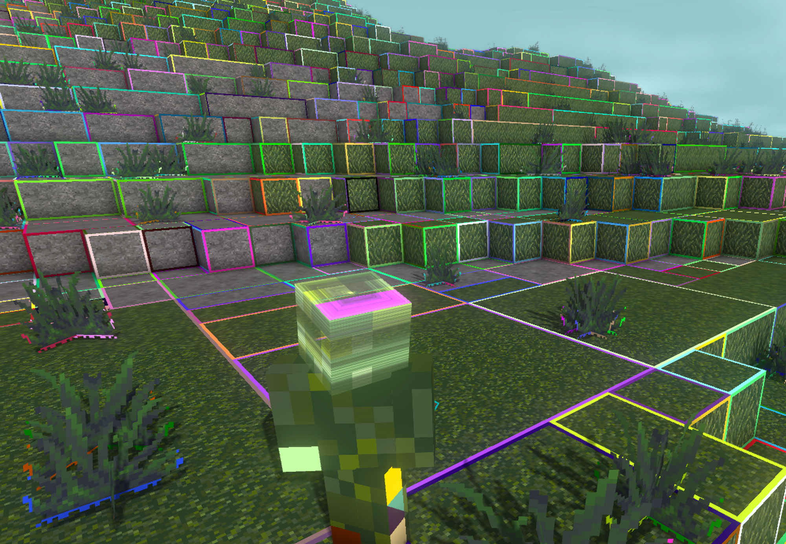
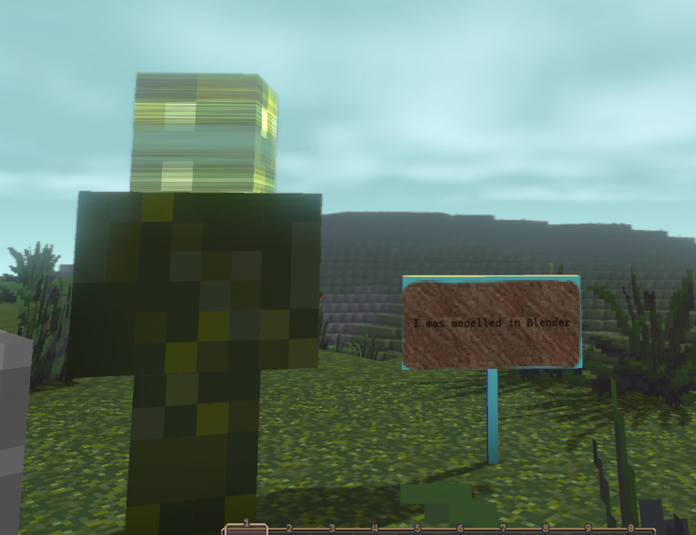
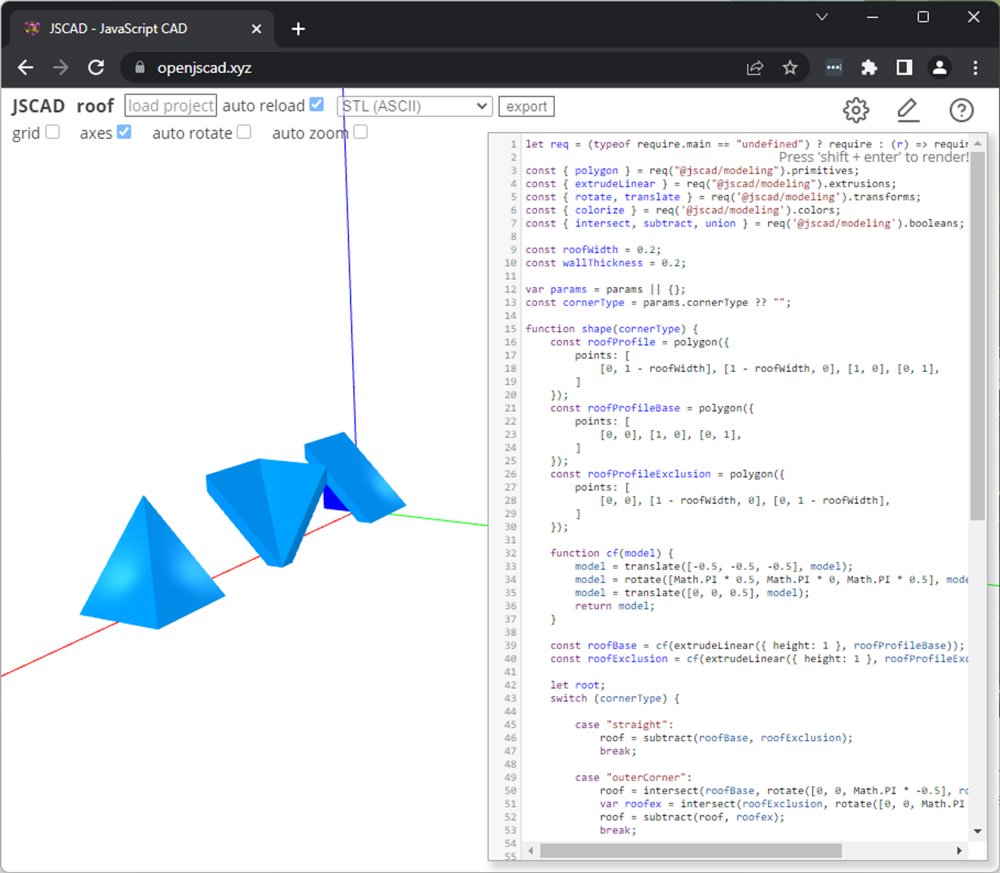
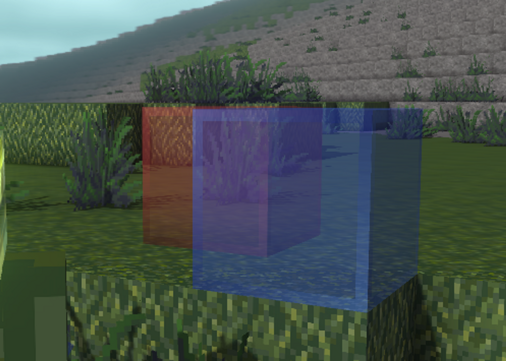
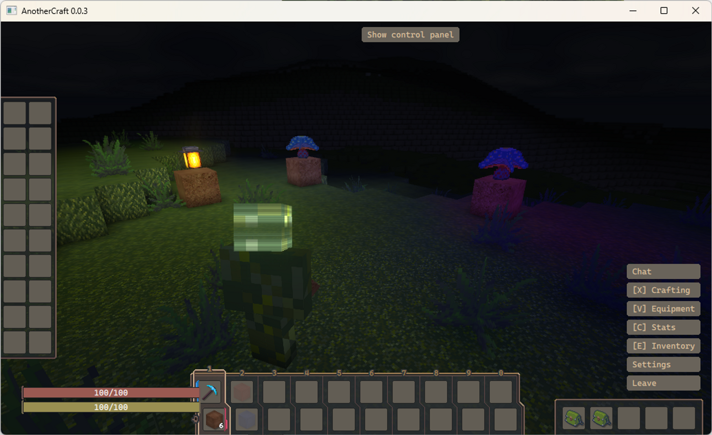
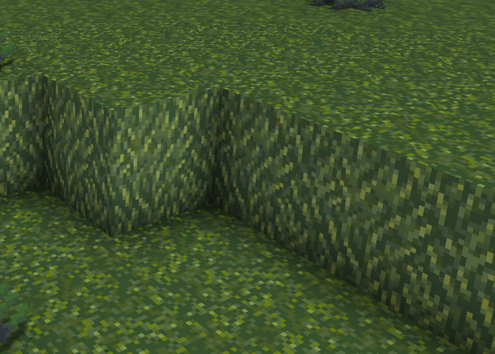

# Rendering

- The game engine is written in pure C++, employing the OpenGL 4.6 graphical API, reyling on advanced functionality like compute shaders, texture and buffer atlases.

- Mesh generation is done on CPU, but with GPU optimization step.

  - This means that the game is not limited to just blocks in terms of shape, you can have any shape you want.

  - But on the other hand, basic shapes (especially cubes) are heavily optimized and the game allows rendering huge view distances.

    

    Optimized rendering of blocks - mutliple blocks of the same type are aggregated into a single rendered quad (visualisation can be turned on in control panel → block face debug → aggregation)

  - In fact, **the engine can render arbitrary OBJ and FBX models.**

    

  - In even more fact, **the engine also supports models directly from JSCAD**.

    

    Multi-material roof block, multiple cornering variations described in the single OpenJSCAD that can be directly imported by the AnotherCraft client

    - Minecraft usually uses very simple geometry, which is often easier to describe with CAD rather than having to meddle around in a modelling software.
    - Additionally to that, **the models can be parametric** and parameters can be defined in the game content configuration files. This means that you can use a single CAD file for multiple roof block types, each with different texture, thickness, and you can also define multiple variants of corner shape of the roof block in the same file.

- The engine employs a number of render optimization techniques:

  - Greedy meshing
  - Aggregating renders to `glMultiDrawArrays` calls
  - Frustum culling
  - Occlusion culling
  - Vertex and texture buffer atlases
  - Tightly packed vertex data (the most compact format used for grid aligned rendering uses just 16 bytes per quad for encoding everything - vertex position, normal, texture index and UV mapping)

- We have some block animations (grass, leaves waving in the wind) that are implemented in vertex shaders, so they’re basically free.

## Transparency

- The engine can handle transparent blocks using the depth peeling technique.
- The transparency is somewhat limited though (there’s a limit on how many transparent layers are rendered over each other - 2 by default, can be changed in the settings, but costs performance), so alpha testing is used instead for most stuff.

# Shading, lighting system

- Shading and light calculation is fully GPU accelerated. It is also light source count agnostic, meaning there’s basically no performance cost for adding more lights.

- The lights can only be static, though, you cannot have a light source moving between blocks (well, you could, but it’d be a little more complicated than that, plus the light sources are always block center-aligned, so it would a bit chunky).

- AnotherCraft uses different approaches for daylight and having blocks as light sources.

  - Block source lighting is propagated on a voxel grid, just like in Minecraft. Except the **lights are fully RGB** (4 bits per channel). The shading is smooth. Light level decreases by 1 with each block of distance for each channel.

    

    RGB block lighting

  - Daylight propagates similarly as the standard light, except it does not decrease when propagating downwards (again similar to Minecraft). Additionally to that, there’s **shadow mapping** from the sun. The light is also directional, meaning it is influenced by the normals.

    

    Daylight with shadow casting

- Ambient occlusion is an emergent property from the shading system used, which means it’s completely free.

  

  Ambient occlusion in the corners of the blocks – emergent behavior from the lighting system implementation

# Environment effects

AnotherCraft has a number of visual effects implemented:

- Beautiful configurable skybox
- Clouds
  - Clouds are dynamic, change and move (generated on GPU)
- Atmospheric tint, blur
- God rays

- - 