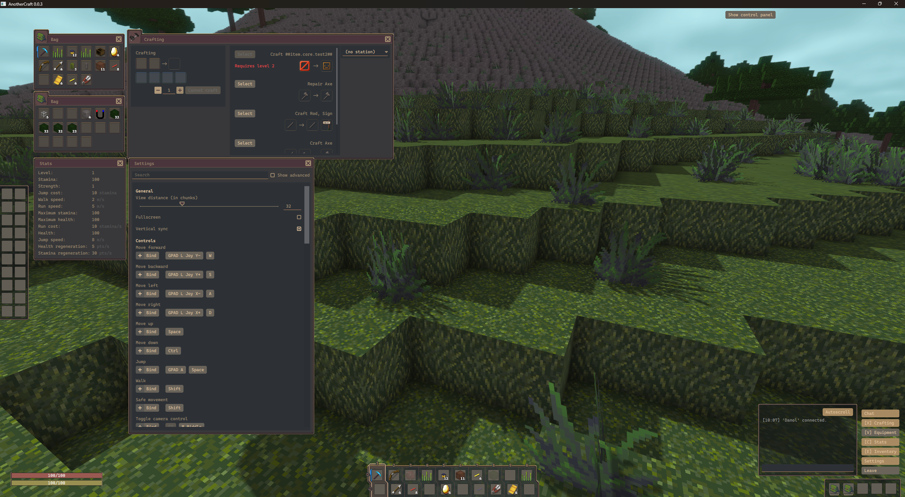

# GUI

The graphical user interface in AnotherCraft is implemented in Qt Quick/QML. The created classes can be found inside `client/qml/ac/client/gui`.

For interacting with the game, a bunch of interface classes were created.

* The most notable class is `QMLSlotInterface` that represents one slot - this can be an inventory slot, hotbar slot, or even a "block slot" (used for displaying for example chest block icon in the title bar of the chest inventory window). It's basically a wrapper over the `SlotInterface` class.
* For interfacing with various other objects, there are also `QMLCurrentPlayerInterfce`, `QMLInventoryInterface`, `QMLActorInterface`, `QMLActorStatInterface`, `QMLActorStatusEffectInterface` and so on.

* There's also a set of QML controls that are set up to be linked with [hive](hive.md) – those would be in the `hive` subdirectory.
* There's also the `QMLCallbackInterface` class that's used for passing callable C++ functions (`std::function`, callable through `call()`) into the Javascript code.

## Windows

The game GUI is based around windows, similar to WoW. 



The window management system is currently a bit basic, in the future there could be features like window snapping, moving groups of windows together and such. For now, the `QMLWindowManager` class only keeps track of open windows, makes sure that a window for the same thing is not opened twice, and positions windows when they get opened nicely.

The windows are based around the custom `Window` QML component. They have a title and an icon. The icon is identified by a string, if it starts with `icon:`, a standard icon is used (`res/icon` folder), if it starts with `image:`, it expects a path to the file (in the way the standard `Image` QML class works). Otherwise, it is considered to be a slot link (see the `SlotInterfaceBaseLink` class implementation for the link format).

## Panels

The GUI is mostly composed from rectangles with skins. To make this easy to work with, a "panel" system was developed. It allows defining such skinned rectangles with a single image and a yaml file. The panel skins are stored in the `bin/res/gui/panel` folder. For windows with big icons (for example the inventory windows in the screenshot above), the panel looks like this:


The image consists of 9 parts separated by a 1px space - the edges, corners and the infill/center. The panel can be rendered in any size; this is realized by tiling the center parts of the image.

Then, there's an associated yaml file (whose name actually is the panel identifier) that specifies where the line separators are, panel margins and such. Also, it can be used to change colors in the image using the `replaceColor.#SOURCECOLOR: #TARGETCOLOR` syntax.

Additionally, the panel can be made parametric a bit - you can make it change colours by additional parameters passed to the `style` parameter of the `Panel` QML class using the syntax `style = "panelID,param1,param2,param3,..."`. The yaml file can then have conditional keys under the `paramX` key like so:

```YAML
x1: 5
y1: 28

x2: 7
y2: 30

type.bigIcon:
  image: window_bigIcon.png

  x1: 44
  x2: 46

  y1: 40
  y2: 42

  leftMargin: 5
  rightMargin: 5


type.noTitleBar:
  image: window_noTitlebar.png

  x1: 5
  x2: 7

  y1: 5
  y2: 7


replaceColor.#B43DCC: "#4a353c"
replaceColor.#E24CFF: "#5e4646"

state.hovered:
  replaceColor.#B43DCC: "#573d45"

worldRelated:
  replaceColor.#B43DCC: "#354549"
  replaceColor.#E24CFF: "#44575B"

state.hovered&worldRelated: # Notice the & conjunction
    replaceColor.#B43DCC: "#3d4d57"
```

