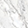
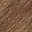
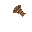
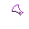
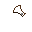
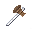
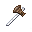

# Modular tools system
AnotherCraft uses a modular system for creating tools (pickaxes/axes/...):
* Tools are combined from various parts (for example pickaxe = rod + pickaxe head)
* Each tool part can be of a different material
* Material selection affects the quality/properties of the resulting tool

Materials, tools and tool parts can be easily added by mods.

## Defining a material
Materials are defined by:
* A 32×32 px texture of the material
* A color palette (replacing colours from `sourcePalette.png`)

## Defining a tool part
Tool parts are defined by:
* A mask that is applied on the material texture, defining which parts of it are visible
* An overlay image that is then put over the masked out texture.
  * Some colors of the overlay image are replaced with material specific colours (source palette -> material palette)
  * You can use colours outside of the source palette. Those colours will simply not be changed and kept as is.
  * You can use alpha & semi-transparent overlays.

## Tool icon generation
Tool icon generation is done as follows:
1. The generation starts with a transparent, 32×32px image
1. For each part the tool consists of (for example rod, pickaxe head):
   1. Material texture (material the current tool part is made of) masked out with the tool part mask is drawn
      * Alpha is multipled with the tool part mask alpha.
   1. Overlay is drawn, colors from the source palette are replaced by the colors in the material palette
	
## Example
>Axe: marble rod + wooden head
1. Mask marble texture () with rod mask () -> 
1. Take rod overlay (), replace source palette with marble palette (  ->  ) -> 
1. Mask wood texture () with axe head mask () -> 
1. Take axe head overlay (), replace source palette with wood palette (  ->  ) -> 
1. Combine all images:  ->  ->  -> 

# Example generator
In this directory, you can find an example tool generator for testing purposes written in Python 3. It generates every icon combination of `tools`, `parts` and `materials` into the `out` folder.

* `materials` folder defines materials:
  * `[materialName]_palette.png` defines material palette (colours from `sourcePalette.png` will get replaced by the ones defined in this file)
  * `[materialName]_tex1.png` defines material texture
* `parts` folder defines tool parts:
  * `[partName]_mask.png` defines mask for masking the material texture (only alpha channel is used)
    * This file is optional. When not provided, the material texture is not applied at all and only the overlay is used.
  * `[partName]_overlay.png` defines overlay that is then drawn over the masked out material texture (colours that are defined in the `sourcePalette.png` are replaced by the material palette colours)
* `tools` folder defines tools
  * Each tool is represented by `[toolName].yaml` YAML file.
  * Root of the file is a map that should contain the `parts` entry. This entry contains list of parts the tool consists of. For example `axe.yaml`:
```YAML
parts:
  - rod
  - axeHead
```

## Running the generator
Installing prerequisities:
```bash
sudo apt install python3
sudo apt install python3-pip
python3 -m pip install Pillow
python3 -m pip install pyyaml
```

Adjust the source material, tools and parts to your liking, then run by:
```
python3 exampleGen.py
```