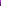

# Modular tool system

## Color palettes for modularTools
For work with different textures/materials AnotherCraft generator uses 
6 colors from default palette defined in **sourcePalette.png** 
with gradient of violet colors from bright to dark.

Default color | Used for
-|-
 &#x2BC0;  |   brighter highlight
 &#x2BC0;  |   darker highlight
 &#x2BC0;  |   brighter material
 &#x2BC0;  |   darker material
 &#x2BC0;  |   brighter shadow
 &#x2BC0;  |   darker shadow

### Example
Let's create new material - wood.
1. Define gradient of 6 wood colors using default palette system - two colors for highlight, two for material itself, and two for shadows, like:

> Wood color | Used for
> -|-
>  &#x2BC0;  |   brighter highlight
>  &#x2BC0;  |   darker highlight
>  &#x2BC0;  |   brighter material
>  &#x2BC0;  |   darker material
>  &#x2BC0;  |   brighter shadow
>  &#x2BC0;  |   darker shadow

2. Make a copy of **sourcePalette.png** with these colors, name it **wood_palette.png** and place it into **materials** folder.

3. Create a material texture (.PNG, 32x32 px), name it **wood_tex1.png** and place it into **materials** folder.

As a result, these palette and texture will be used for rendering wood parts of the tool elements.
